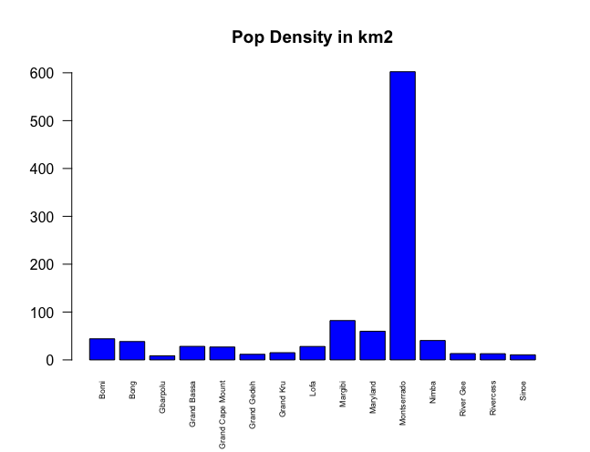
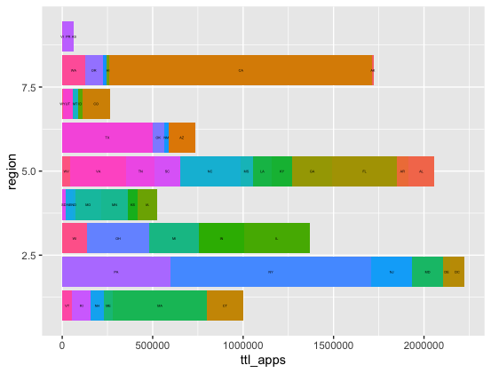
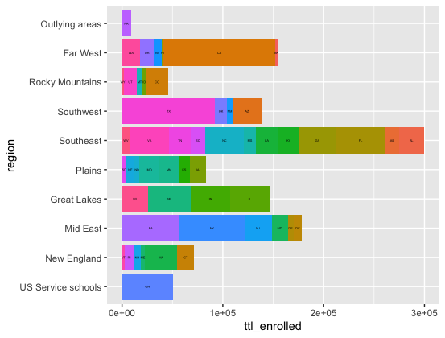

# Data Management Basics

# Bar Graphs Part 1
To create these bar graphs for this assignment, I had to import two sets of data pertaining to the population and dmographics of Liberia and one from a remote data set and the other from a source data set. Using R, the plots I had to create consist of a y-axis (number of people) and x-axis (names of the counties).

# Bar Graphs Part 2
To create these bar graphs, I imported two sets of data (one that described the admissions and the test scores while the other described the colleges and universities). I then then had to create the plots with according to the regions and subset the data to filter out the colleges that were not 4 year colleges or doctorate colleges to get the total admitted students and total enrolled students. 

