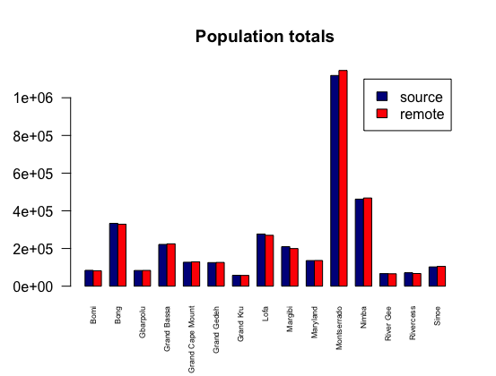

# Data Management Basics

# Bar Graphs 
To create these bar graphs for this assignment, I had to import two sets of data pertaining to the population and dmographics of Liberia. Using R, the plots I had to create consist of a y-axis (number of people) and x-axis (names of the counties). 

