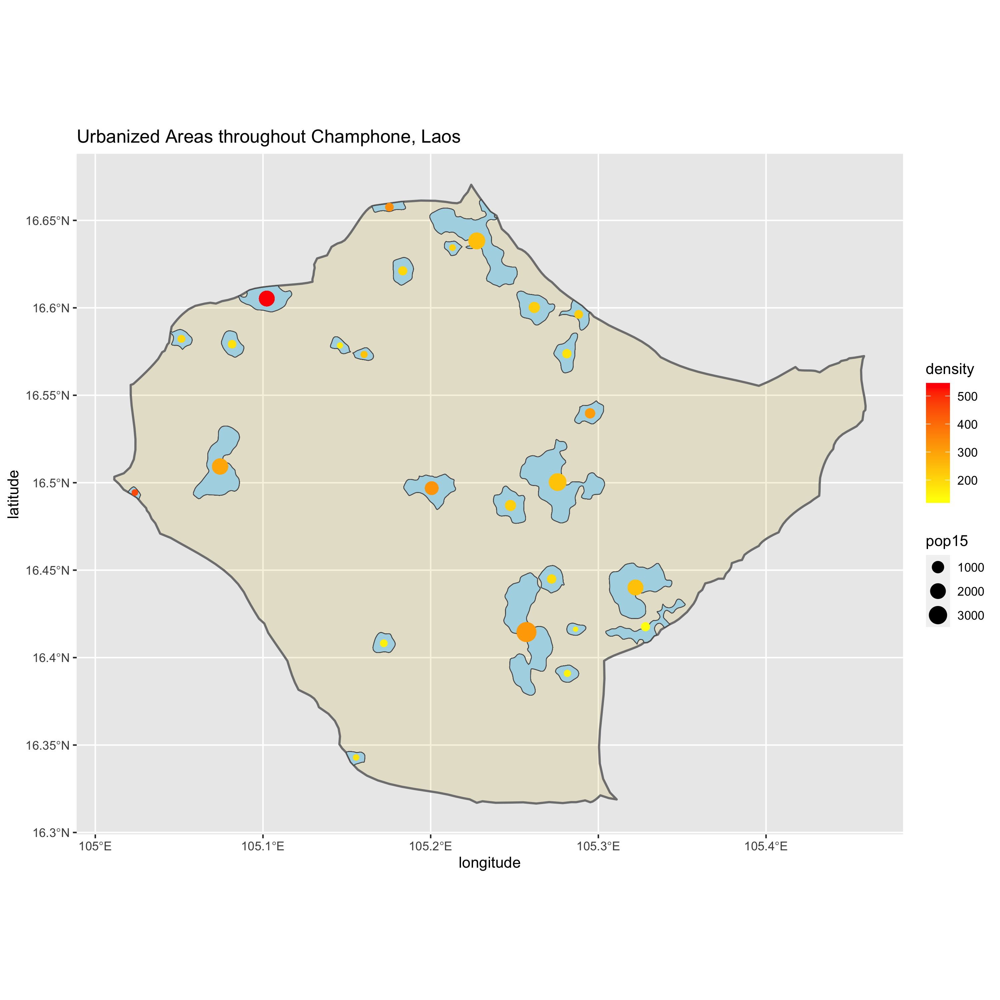
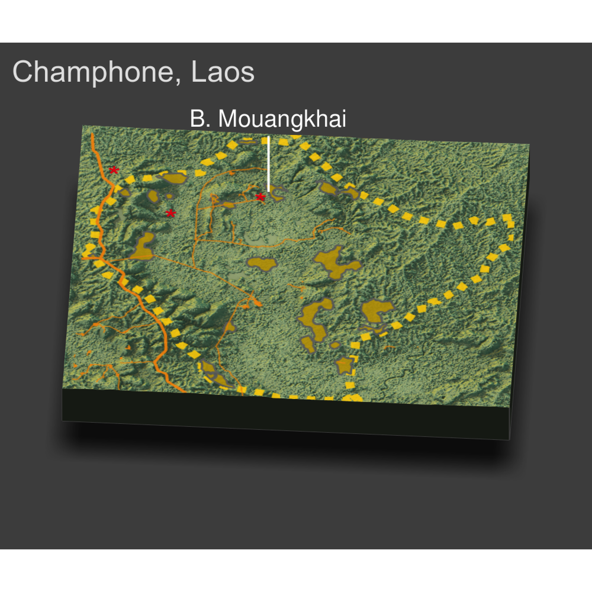

# Final Project 
Description of human settlements, urban areas, and facilites in the district of Champhone. This district is located in second most populous provinces of Laos, Savannakhet (the first being Vientiane) and is made up of bodies of water and other agriculture land, which make it ideal for farming. 

## De facto description of human settlements and urban areas (Accessibility 1)
This plot desribes the urbanized areas of Champhone and the population density according to the size and color of the points. To create this plot, I first imported the adm2 shapefile and the population raster and then filtered data to focus on Champhone to create the polygons that represented the urban areas. 
### Team Challenge Question

## Adding transportation and school facilities (Accessibility 2)
This plot desrcibes the raods and schools within Champhone. The total combined population is 121,931 people and the total number of distinctly defined urban areas is 26. Due to the fact that this district is a fairly rural area, the population is spread out and the urban areas are disconnected; however, they are relatively close together and near road systems and some human settlements seem to live right along the primary or secondary roads. Further, this district only has two schools (one is out of the political boundary) and they are located seemingly in the midpoint of selected villages in the north and near the roads.  
### Individual Deliverable

## Rendering Topography (Accessbility 3)
This 3D plot descibes the land area of Champhone and identifies one of the major villages of Champhone, B. Mouangkhai. As influenced by the topography, many of the urban areas lay towards the eastern side of the district due to the fact that the topography is mainly flat and made up of valleys, indicating that this land is ideal for farming. Furthermore, the primary road that runs along the side of the politcal boundary seems to be more mountainous, while the secondary and tertiary road systems run along flat land. Conversely, the education facilities do not seem to be impacted by the topography because there is not enough data to show throughout the district; however, the schools seem to be located on flat lands. Producing the 3D map has resulted in an alternate interpretation of this district because when I first researched the area, the only reason for the urbanized areas were that it was near rivers or lakes; however, after seeing the 3D plot, I was able to conclude that these urbanized areas also settled in these regions due to the flat lands that made farming easier and attainable.  
### Individual/Group Deliverable 

