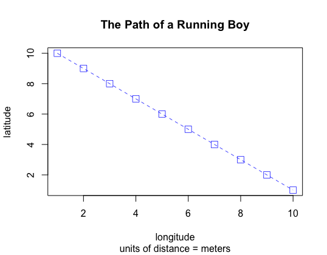

# Practice Excercise
# Getting Started With RStudio

To plot "The Path of a Running Boy", first the x and y coordinates have to be determined. Then, the command "plot(x,y)" must be typed to create the plot and once that is established the line weight, color, and symbol can be changed.

