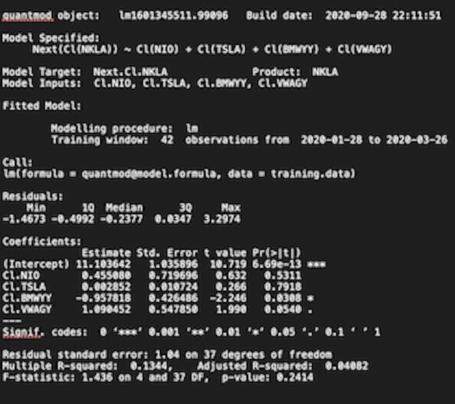

# Data Fundamentals (Project 2)

To create this plot, I had to first obtain data from the Federal Census Bureau using an application program interface (API). Then I had to bind and convert the data to a long format and plot it using ggplot. The data shows the populaiton of the states in the USA according to the years 2000, 2010, and 2014.

## Part 1

### Deliverable 

### Stretch Goals 

## Part2

### Deliverable 1 (Plot)

#### Deliverable 2 (Model Summary)

