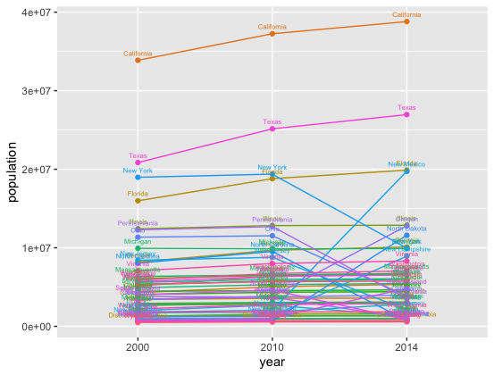
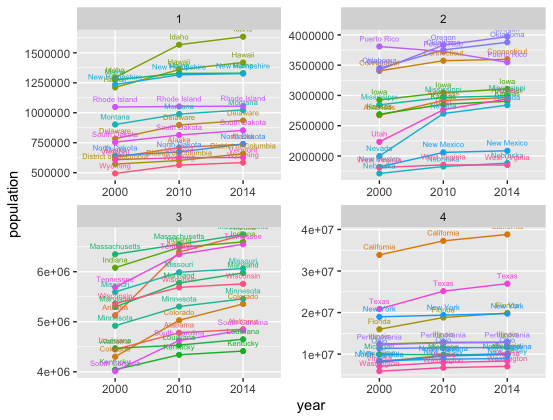
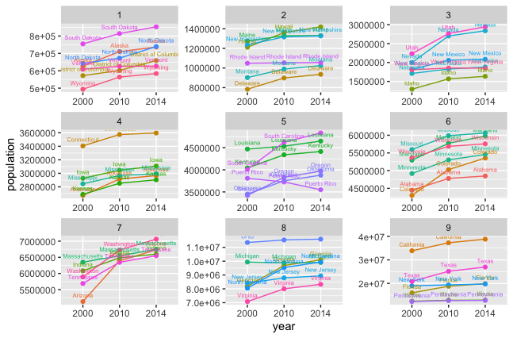
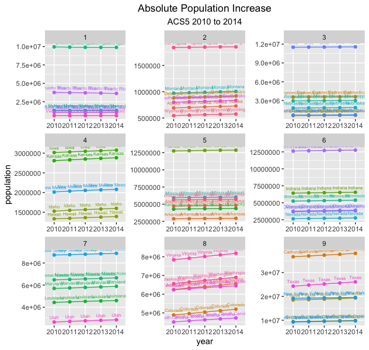
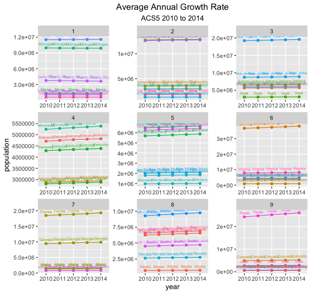
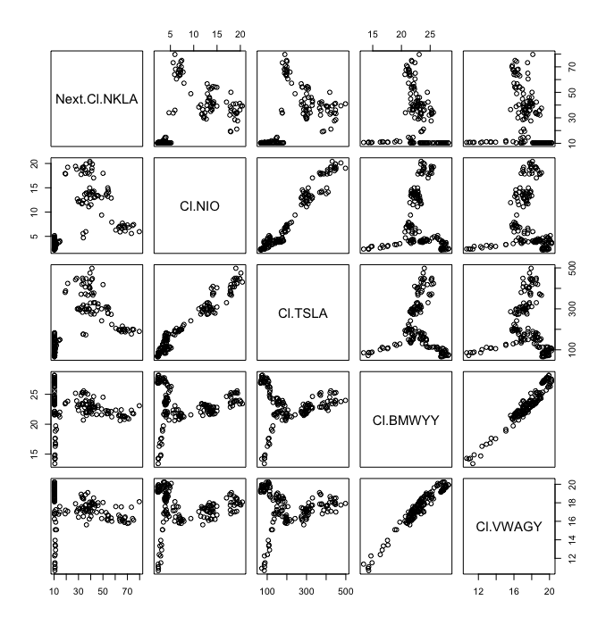
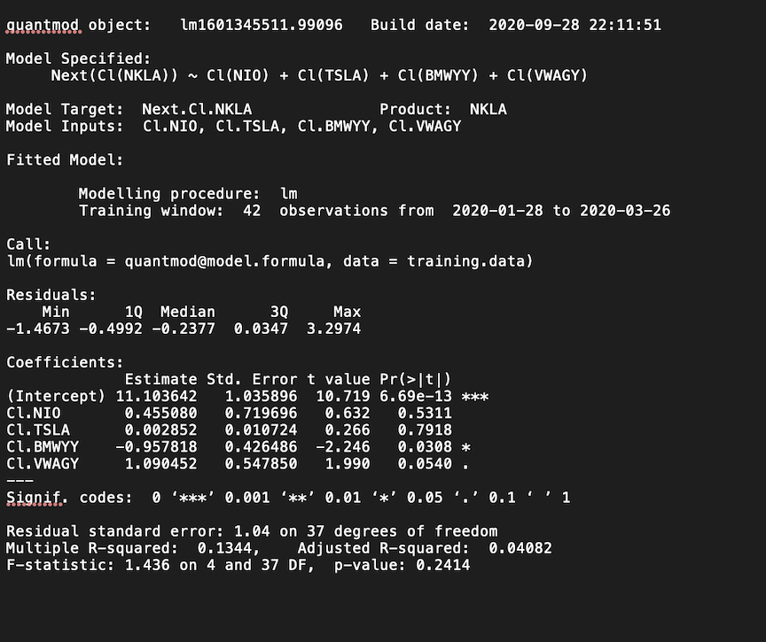

# Data Fundamentals (Project 2)

To create this plot, I had to first obtain data from the Federal Census Bureau using an application program interface (API). Then I had to bind and convert the data to a long format and plot it using ggplot. The data shows the populaiton of the states in the USA according to the years 2000, 2010, and 2014.

## Part 1

### Deliverable 

### Stretch Goals 

## Part 2

For part 2 of this project I wanted to look into how the stocks differ among major electric car companies or companies that sell electric vehicles; therefore, I decided to analyze stocks from Tesla, Nikola, Nio, BMW, and Volkswagon. I created the models to predict the stocks of Nikola (response variable), using the current stock prices of the other companies as the predictors. 
### Deliverable 1 (Plot)

### Deliverable 2 (Model Summary)

## Part 3

### Deliverable 1 (Bar Graph)

### Deliverable 2 (Line Plot) 

