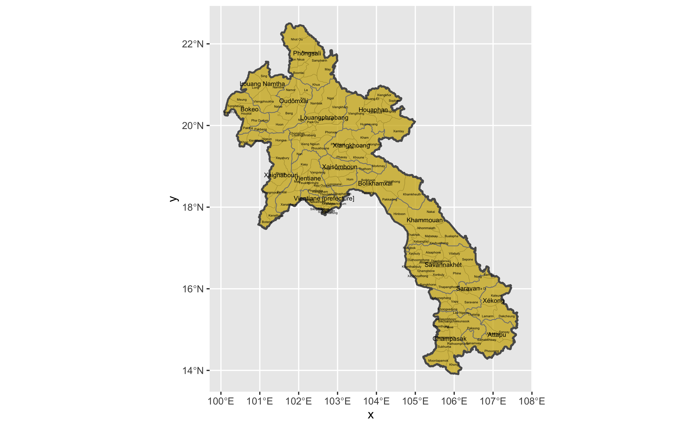

# Projecting, Plotting and Labelling Administrative Subdivisions (Project 3)

To create these maps of Laos, I extracted data from GADM and showed Laos' administrative divides as well as detailed shots of the provinces with their districts. 

## Deliverable 

Shows Laos as a whole along with the country's 17 provinces and it's respective district borders. 

## Stretch Goals

Shows Laos' most populous province (Savannakhet) along with how the districts are divided. 

Shows Laos side by side with some of its most population dense areaa. 
 

[Detail A]
[Detail B]

