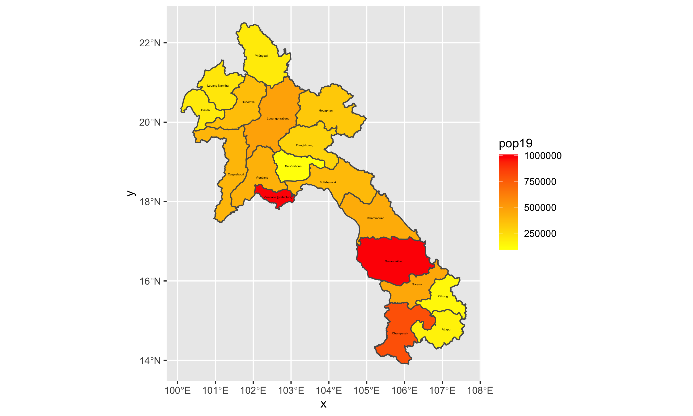

# Extracting Populations from a Raster and Aggregating to each Unit (Project 4)

## Deliverable 1

To create this plot of Laos I had to first download the raster from WorldPop. From WorldPop, I downloaded Laos' population density by its political boundaries (provinces-adm1) and further subdivisions (districts-adm2). From the raster, I imported its data into R and created a visual representation of Laos' population density, red being very dense and yellow being less dense. 

## Stretch Goals

### Stretch Goal 1 

### Stretch Goal 2

### Stretch Goal 3

# Creating a Geometric Bar Plot with your Simple Feature object

## Deliverable 1

## Stretch Goals 

