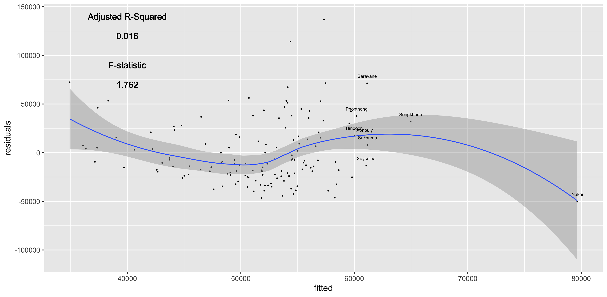

# Acquiring, Modifying, and Describing the Data (Project 5)

To create these histograms and regressions models, I retrieved and imported data from the Worldpop website describing the geography (land use and land cover) of Laos. With this data, I created histograms describing how the land cover is affected by the population and also created linear models describing again how the population correlates with the geography of Laos. 

## Deliverables
### Histograms 

Describes how the night time lights affects the density in Laos

Describes how the log population affects the density in Laos

Describes how the water affects the density in Laos

### Regression Models

Describes the correlation between the night time lights and the population in Laos

Describes the correlation between the grasslands and the population in Laos

#### Stretch Goal

As shown the R squared value is far from one; therefore, the correlation between the explanatory and response variable is very weak
